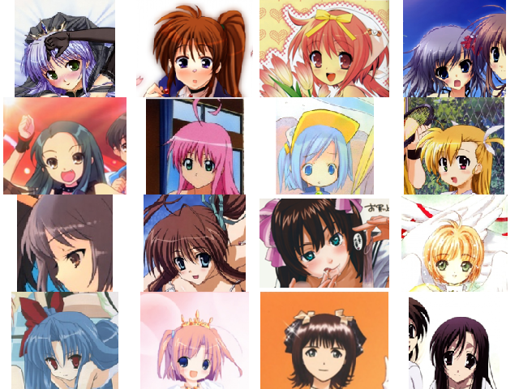

# Automatic animeface generation using DCGAN in pytorch  
> Using DCGAN for generating anime faces.  
  
## Images generated randomly after 8750 iterations of training  
### Sample 1:    
   
  
### Sample 2:  
  
   
### Sample 3:  
   
  
## Original Images for comparision  
  
  
## Generated your own kawaii anime faces  
To generated your own images  
```bash
$ python generate_faces.py ((number of images to generate)) ((filename to save))
```
## DCGAN Specifics  
1. I have used BCEloss_with_logits for better numerical stablilty than default BCEloss , read the following for more info - https://www.tensorflow.org/api_docs/python/tf/nn/sigmoid_cross_entropy_with_logits.  
2. The Generator network has 1 more extra layer than discriminator so as to make it more powerful.  
3. Rest of the code is mostly same as the original DCGAN(https://github.com/pytorch/examples/tree/master/dcgan).  


## Dataset used
-> The dataset I ended up using - https://www.kaggle.com/xxc025/animefaces  
-> Similar dataset - http://www.nurs.or.jp/~nagadomi/animeface-character-dataset/  

## Similar Projects    
https://github.com/forcecore/Keras-GAN-Animeface-Character  
https://github.com/jayleicn/animeGAN  

## Relevant Paper  
https://arxiv.org/pdf/1708.05509.pdf  

@Prakarsh-Bhardwaj
